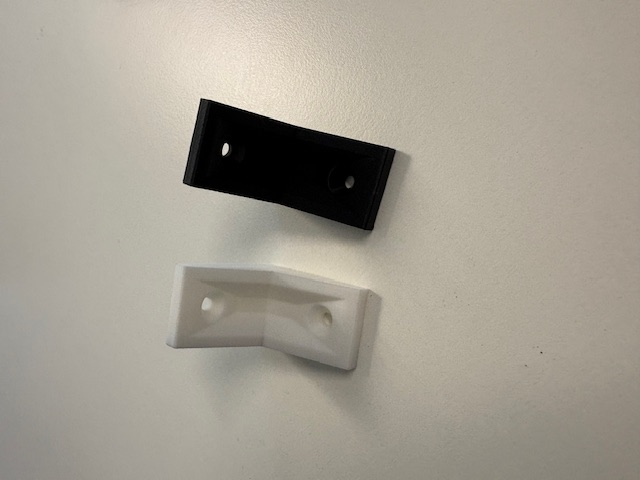

# 3d-prints

Here you can find all the files to 3D print the corners to properly mount the game console.

## Double Corner
[Double Corner](./Double-Corner) : Here you can find a corner to fasten with 4 screws.

## Enkel hoekje
[Small Corner](./Small-Corner) : Here you can find a corner to fasten with 2 screws.

