# Housing

Here you can find everything to make the housing step-by-step for laser cutting and assemble everything.

## Step 1

To visualize our **idea**, we first created a 3D model in Fusion.
This allowed us to check if the design looked good and if the layout worked well. 
By doing this first, we were then able to start drawing each individual part separately in Fusion.

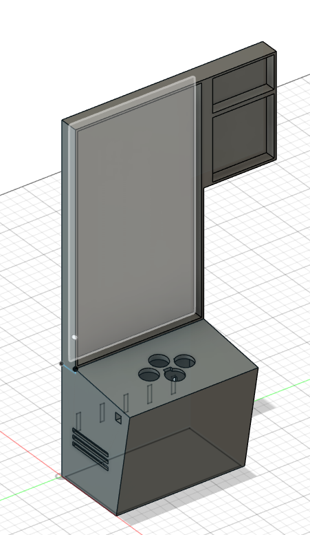 

## Step 2

Next, we designed the **playfield** separately in Fusion. We added small rectangles at the ends so that all the parts fit together perfectly. We also included grooves on all sides to make sure the inner plates slide right in. On the back of these inner plates, we made small channels so the LED strip can easily be attached to the backplate.

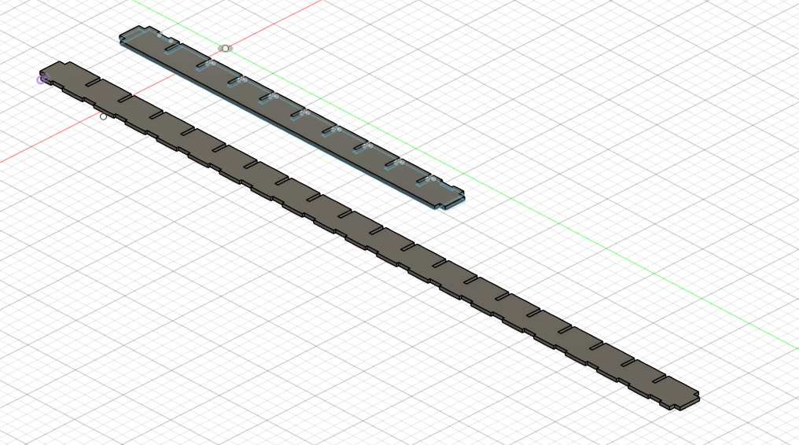
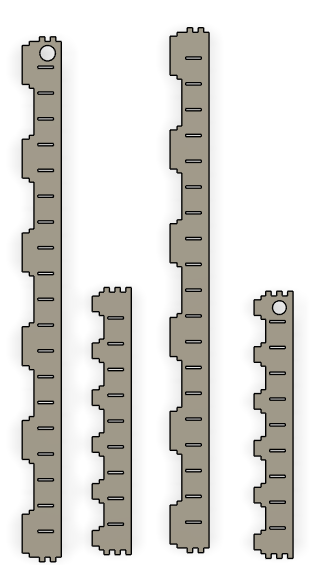
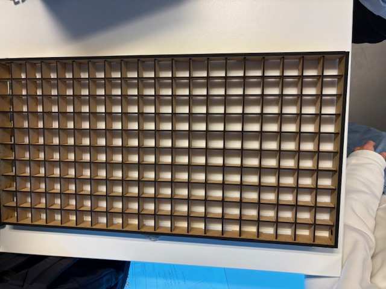

## Step 3

Then, we designed the **next field block** separately in Fusion, using the same method as we did for the playfield.

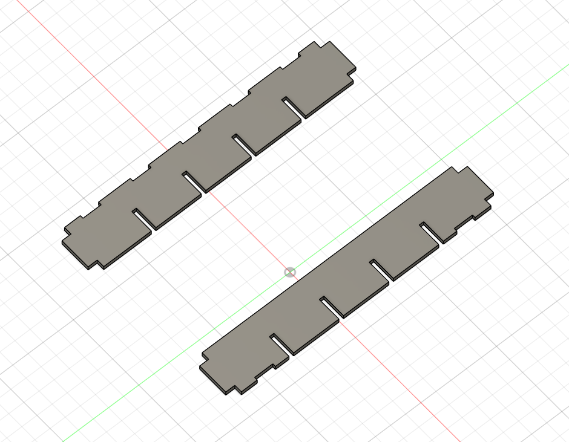
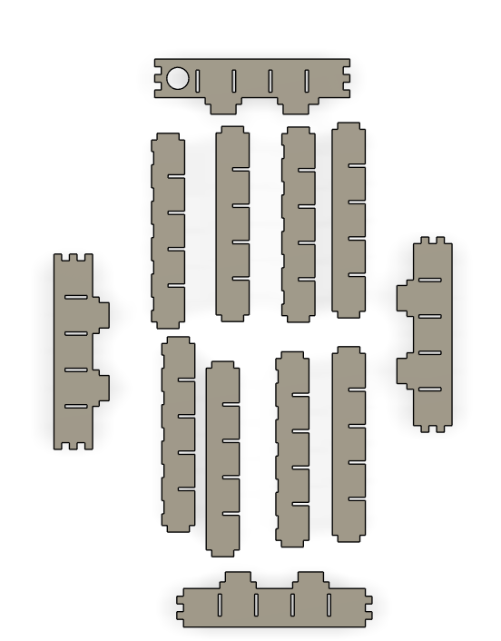
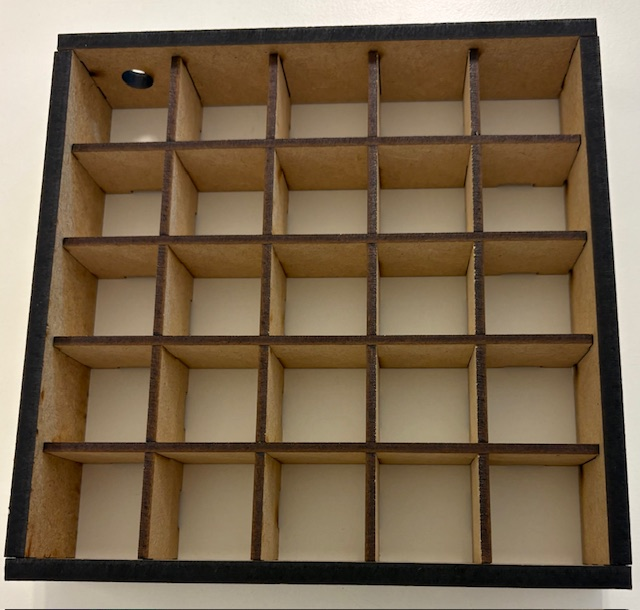

## Step 4

Behind that, we designed the **console and the 2 backplates** separately in Fusion. We added small rectangles at the edges so they fit together perfectly. On both sides of the console, we created slots for ventilation. We also included a hole at the front for the speaker. On top of the console, we made five holes: four for the game buttons and one for the play/pause button. Finally, we placed an on/off switch on the left side.

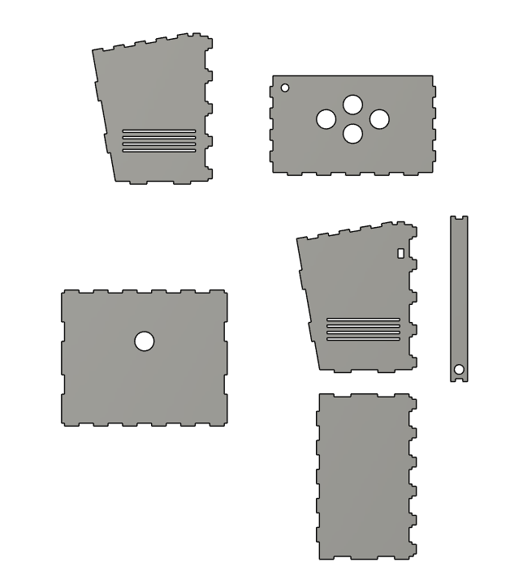
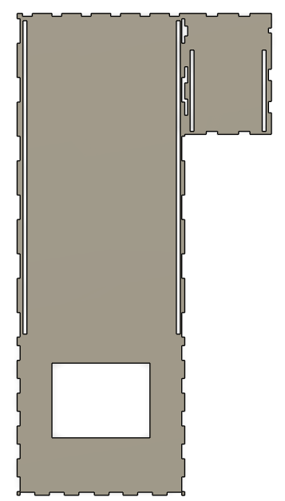
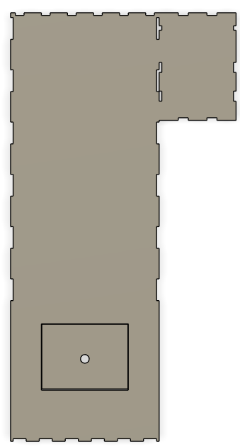

## Step 5

Finally, we put everything together.

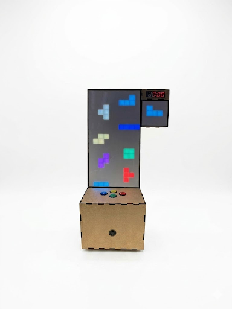
